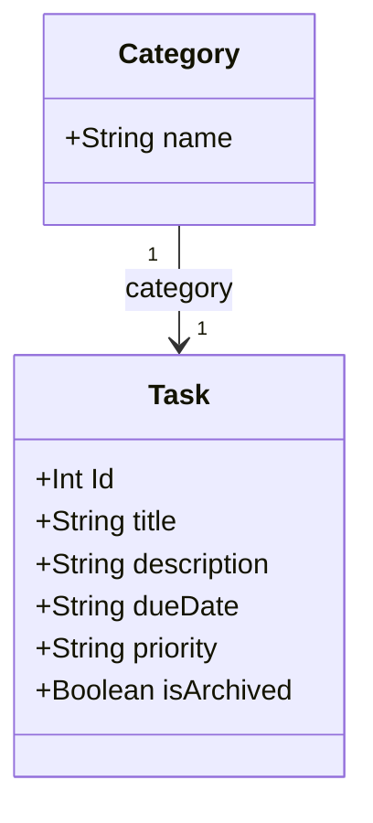

## Mind Map

``` Memaid
mindmap
  root((TODO App))
    Tasks
        Categories
            Work
            Personal
            Study
            Gym
        Priorities
            High
            Medium
            Low
        Status
            To Do
            Doing
            Done
    Features
        Add task
        Edit task
        Delete task
        Archive task
    Organisation
        Sort Tasks
            By Date
            By Priority
            By Category
        Search Tasks
            By Keyword
            By Status
```

## Class Diagram


## User Stories


### Initial Release

#### Task Making
- As a user, I want to add a task so that I can keep track of things I need to do.
- As a user, I want to edit an existing task so that I can update its details should things change.
- As a user, I want to delete a task so that I can remove completed or tasks that are no longer needed.
- As a user, I want to archive a task so that I can clean up my list of tasks and have the option to revisit it if needed.

#### Organisation
- As a user, I want to search for tasks so that I can quickly find a specific task (includes title and description).
- As a user, I want to categorise tasks so that I can group them into work, personal, study or gym.

#### User Experience
- As a user, I want to view all tasks with their priorities and due dates so that I can get a clear overview of my tasks.
- As a user, I want to add detailed descriptions to tasks so that I can include more information about what needs to be done.
- As a user, I want to set due dates for tasks so that I can manage my time more efficiently.
- As a user, I want to see tasks grouped into categories so that I can organise tasks by their purpose.

### Future Release

#### Task Making Improvements
- As a user, I want to set recurring tasks (daily, weekly, monthly, yearly) so that I don’t have to re-enter repetitive tasks.
- As a user, I want to set reminders/notifications for tasks with approaching deadlines so that I don’t miss important tasks.
- As a user, I want to create group tasks to share with others so that I can work on group projects with people.
- As a user, I want to add colour tasks visually by status e.g. Important tasks are red.

#### Organisation Improvements
- As a user, I want to sort my tasks by priority so that I can focus on the most important ones first.
- As a user, I want to sort tasks by due date so that I can prioritise tasks based on deadlines.
- As a user, I want to sort tasks by status so that I can easily view tasks based on their progress.
- As a user, I want to pin tasks to the top of the list so that I can keep important tasks visible at all times.
- As a user, I want to be able to make my own categories outside of the ones provided by the app.

#### User Experience Improvements
- As a user, I want to customise the app theme so that I can adjust it to my personal preference.
- As a user, I want the UI to be simple to use, yet the app will have more features.
- As a user, I want to be able to create a template for apps in categories, e.g. gym template.